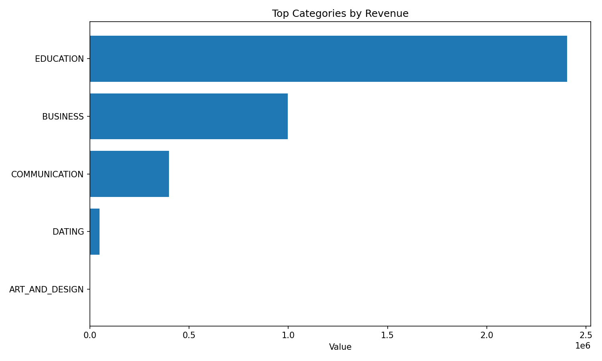
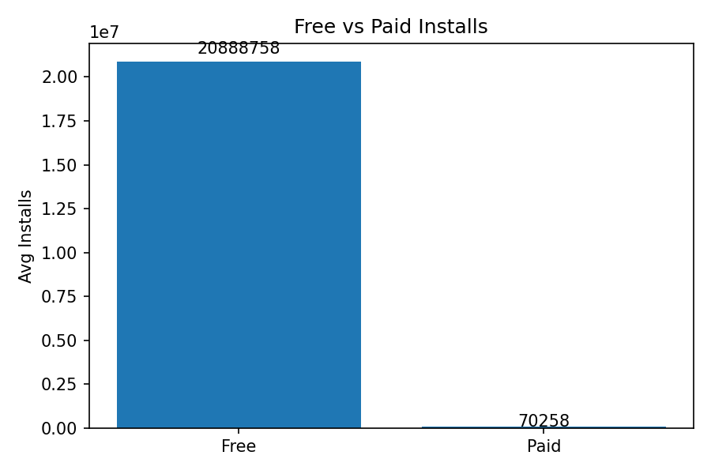

# Executive Market Intelligence Report

**Generated:** 2025-09-27 17:19:23

---

## Executive Summary

### Top App Category by Installs
Communication apps dominate with over 10.6 billion installs, underscoring strong consumer demand for connectivity tools like messaging and social platforms. This category outpaces others, signaling opportunities in digital interaction features.

**Key Insight:** The EDUCATION category drives the highest revenue at $2,403,980, outpacing all others—indicating a prime opportunity for targeted investment and expansion to sustain growth.

### Key Insight: Free Apps Dominate Install Volume
Free apps achieve ~297x more installs on average (20.9M vs. 70K for paid), highlighting the need to prioritize free or freemium models to drive user acquisition and scale, with monetization via in-app purchases or ads.

**Key Insight:** A 0.00 correlation between app ratings and installs shows no direct link—higher ratings aren&#39;t driving more downloads. Focus on marketing, visibility, and user acquisition to boost installs independently of perceived quality.

---

## Numeric Insights

### Top Categories by Installs

- **COMMUNICATION** — 10,661,710,000

- **ENTERTAINMENT** — 1,745,000,000

- **BOOKS_AND_REFERENCE** — 1,335,460,000

- **BUSINESS** — 506,010,000

- **EDUCATION** — 352,952,000

### Top Categories by Revenue

- **EDUCATION** — $2,403,980.00

- **BUSINESS** — $998,000.00

- **COMMUNICATION** — $399,000.00

- **DATING** — $48,461.50

- **ART_AND_DESIGN** — $0.00

### Price vs Downloads
- Avg installs (Free): 20888758.0
- Avg installs (Paid): 70258.0

### Rating vs Installs
- Correlation: 0.0025536778371076365

---

## Charts

### Chart 1: Top_Categories_by_Installs.png

### Chart 2: Top_Categories_by_Revenue.png

### Chart 3: Free_vs_Paid_Installs.png

### Chart 4: Rating_vs_Installs_Correlation.png

---
